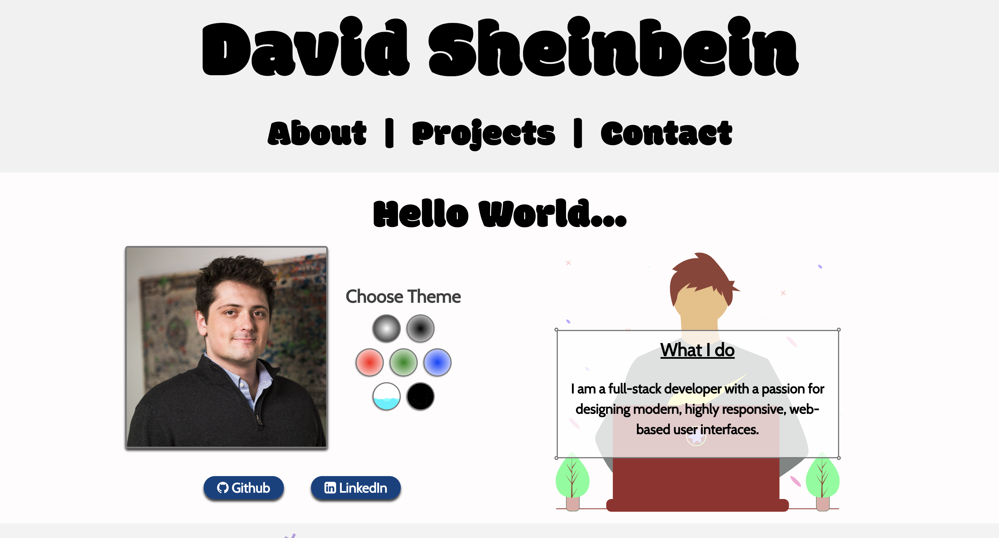

# **David Sheinbein Portfolio**

### Click the link to view the website
[Portfolio Webstite](http://www.davidsheinbeinportfolio.com/) 

### About Me
I enjoy helping people discover and implement interesting ways to scale and grow their businesses and helping them reach their goals in a logical and creative way.

Programming is one of the most versatile and important skills a person can have in today's business world. It enables developers to craft programs unique to any business' specific needs thus facilitating that business' growth.

It excites me to work with established companies and contributing to collective goals.  It excites me to work with startups, helping them from the ground up in  figuring what they are building and helping them do it. I enjoy solving challenges as they arise in the workplace and take pride in the work I accomplish.

Project Work:
https://github.com/davesheinbein

LinkedIn:
https://www.linkedin.com/in/david-sheinbein/

Full-Stack Software Engineering Skills:
HTML5 | CSS | JavaScript | Express | Node.js | Django | Mongoose | MongoDB | Python | PostreSQL | React | React-spring | Animations | Axios | Nodemailer

Developer Tools:
Git | GitHub | MongoDB Atlas | Postman | Heroku | Namecheap | AWS | Third Party APIs

Project Management Skills:
Schedule and Timeline Management | Outreach Strategy and Management | Research | Microsoft Office Suite | Teamwork | Marketing

Creative Skills:
Wireframing | Adobe Creative Suite | Photography | Videography | Canva | Web Design | Undraw | LottieFiles | Google Fonts

## Screenshot:

[Introduction Page Sceenshot](https://imgur.com/jmH30xV)

[Home Page Sceenshot](https://imgur.com/UE1XA40)

## Technologies Used: 

#### 1. HTML5
#### 2. CSS
#### 3. JavaScript
#### 4. React
#### 5. React-spring
#### 6. Node.js
#### 7. Heroku
#### 8. Namecheap
#### 9. Git

## Potential Next Steps: 

##### - [] Play with css more to make colors pop even more
##### - [] Use AWS to store data
##### - [] Update CSS further for additional media queries
##### - [] speed up animation animation

### Click the link to view the website
[Portfolio Webstite](http://www.davidsheinbeinportfolio.com/) 
